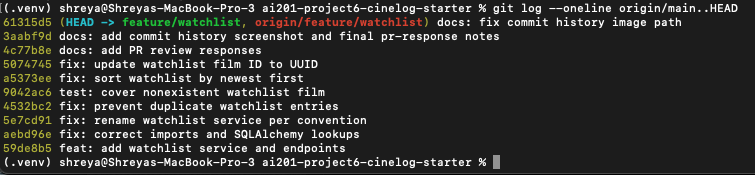

# PR Response Doc — CineLog Watchlist Feature

## AI Usage
I used Claude and ChatGPT to read and thoroughly understand the codebase before starting work — interpreting the project instructions and clarifying a step-by-step timeline for what to do and when. I also used it to troubleshoot my virtual environment and git commands, since I'm a bit rusty there, and to generate commit messages to speed up delivery. I also used
AI-generated drafts as starting points for Comments 4 and 5. I reviewed those
drafts against CineLog's community context and existing collection behavior,
then retained the public-default and newest-first positions while explicitly
acknowledging their privacy and browsing tradeoffs.
Lastly, I used AI to help polish this document for final publishing. 

## Comment 1 — Rename
**What I did:** I renamed `save_to_watchlist()` to `add_to_watchlist()` in `services/watchlist_service.py` so it follows the project's `verb_to_noun` naming convention. I also updated the import and function call in `routes/watchlist/watchlist.py`.

**How I verified:** I searched the entire project with `grep` and confirmed that no references to `save_to_watchlist` remained. I then ran `.venv/bin/python -m pytest tests/ -v` and confirmed the existing test suite passed.

## Comment 2 — Deduplication
**What I did:** I added an `AlreadyInWatchlistError` exception and updated `add_to_watchlist()` to query for an existing entry with the same `user_id` and `film_id` before inserting a new row. I followed the deduplication pattern used by `add_to_collection()` in `services/collection_service.py`.

**How I verified:** I compared the new check with the existing collection-service implementation and confirmed that a duplicate is detected before `db.session.add()` and `db.session.commit()` are called. I also ran `.venv/bin/python -m pytest tests/ -v` and confirmed the full test suite passed.

## Comment 3 — Missing test
**What I did:** I created `tests/test_watchlist.py` and added `test_add_to_watchlist_nonexistent_film_raises()`. The test uses an in-memory database, creates a sample user, passes a nonexistent UUID to `add_to_watchlist()`, and verifies that `FilmNotFoundError` is raised. I modeled its fixtures and assertion structure after `test_add_to_collection_nonexistent_film_raises()`.

**How I verified:** I ran `.venv/bin/python -m pytest tests/test_watchlist.py -v` to verify the new test independently. I then ran `.venv/bin/python -m pytest tests/ -v` to confirm the complete test suite passed.

## Comment 4 — Default visibility
**My position:** I kept watchlist entries public by default.
**Reasoning:** CineLog is a community film-tracking application, so public
watchlists support discovery and conversation between users. A public default
also makes sharing work without requiring every new user to find and change a
visibility setting.

**Tradeoff acknowledged:** A public default provides less privacy for users who
treat a watchlist as personal planning data. A future visibility preference or
per-entry toggle would give those users more control.

## Comment 5 — Sort order
**My position:** I changed the watchlist to sort by date added, newest first.

**Reasoning:** Users are likely to return to their watchlist to find films they
saved recently. Newest-first also matches the existing collection service.

**Engagement with reviewer's point:** Alphabetical sorting helps users scan a
large list by title, but it hides recent activity. For CineLog's current
workflow, consistency and quick access to recently saved films are more useful.

## Comment 6 — Rebase
**What conflicted:** Both my feature branch and the updated `main` branch added a `.gitignore`, which caused an add/add conflict. After the rebase, I also found that the updated UUID model no longer included `WatchlistEntry`, while the watchlist service still depended on it and still documented film IDs as integers.

**How I resolved it:** I kept the `.gitignore` from `main` because it included all required entries plus `.pytest_cache/`. I preserved the PR response template from my feature commit. I then restored `WatchlistEntry` using a UUID string for `film_id`, added its relationship to `Film`, and updated the watchlist documentation to refer to UUID film IDs.

**How I verified no conflict remains:** I completed `git rebase origin/main`, ran `.venv/bin/python -m pytest tests/ -v`, and used `git log --merges origin/main..HEAD` to confirm that the feature branch contains no merge commits.

## PR Description
This PR adds a watchlist service and API endpoints that allow CineLog users to
save films they want to watch later and retrieve their saved films. It prevents
duplicate watchlist entries and returns entries newest first.

I kept watchlist entries public by default because CineLog is a community
film-tracking application. I changed the sort order from alphabetical to
newest-first so recent saves are easier to find and the behavior matches the
existing collection service.

Manual testing:
1. Activate the virtual environment with `source .venv/bin/activate`.
2. Start the application with `python app.py`.
3. Obtain an existing user UUID and film UUID.
4. Send a POST request to `/watchlist/<user_id>/add` with JSON body
   `{ "film_id": "<film_uuid>" }`.
5. Confirm that the response has status 201 and contains the watchlist entry.
6. Send a GET request to `/watchlist/<user_id>`.
7. Confirm that the saved film appears and entries are ordered newest first.
8. Try adding the same film again and confirm that the duplicate is rejected.
9. Run `.venv/bin/python -m pytest tests/ -v`.

## Commit History
